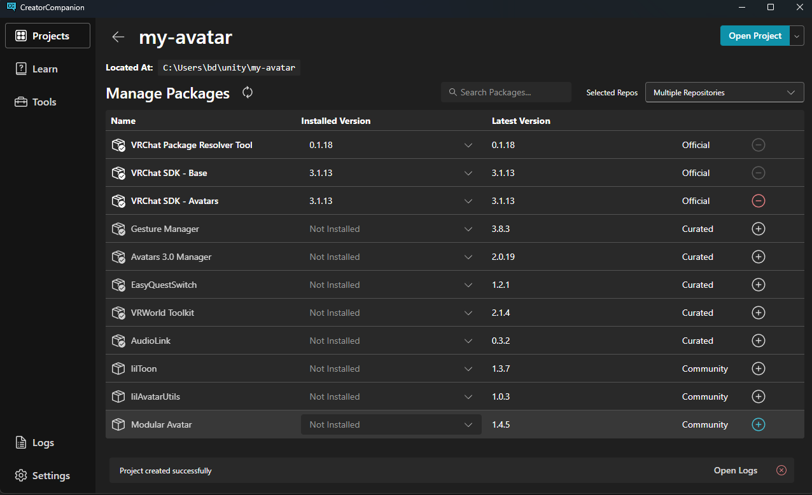

# Modular Avatar

Modular Avatar is a suite of **non-destructive** tools for modularizing your avatars, and for distributing avatar
components.
With Modular Avatar, adding a new outfit or gimmick to your avatar is as easy as drag-and-drop!

Modular Avatar's features are packaged as individual components, which can be added as needed. You can opt-in to just the features
you want to use. It can automatically merge outfits onto your avatar, build an animator out of multiple components, and much more.

## Installation

The recommended way to install Modular Avatar is using the VRChat Creator Companion. After installing the VCC, click here:
* [Add Modular Avatar to VCC](vcc://vpm/addRepo?url=https://vpm.nadena.dev/vpm.json)

Then, go to "manage project" for your project, and click the + next to Modular Avatar.

To update to the latest version, just click the green arrow in the "Latest Version" column.

Once you've installed MA, check out one of the tutorials below:
* [Simple clothing setup](/docs/tutorials/clothing)
* [Advanced clothing setup](/docs/tutorials/adv_clothing)
* [Toggle an object](/docs/tutorials/object_toggle/)
* [Edit menus](/docs/tutorials/menu/)

## Manual installation

You can also manually install Modular Avatar from unitypackages. The latest packages can be found at the [GitHub releases page](https://github.com/bdunderscore/modular-avatar/releases).
Note that in some cases it may be necessary to delete the Modular Avatar folder before upgrading.

## Prerelease versions

To make prerelease versions available in the VCC, [click here](vcc://vpm/addRepo?url=https://vpm.nadena.dev/vpm-prerelease.json)

The documentation for the prerelease branch can be [found here](https://modular-avatar.nadena.dev/dev).

Prerelease versions may contain bugs, and/or may have compatibility breaks as development progresses. Please leave
feedback and bug reports at the [github issues page](https://github.com/bdunderscore/modular-avatar/issues).