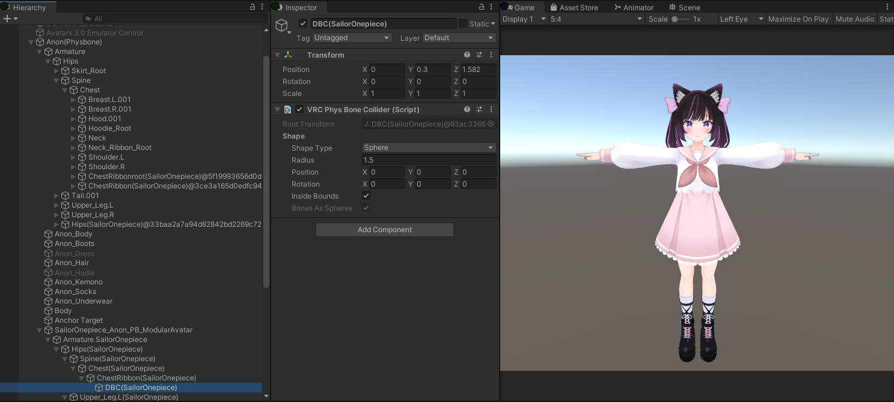
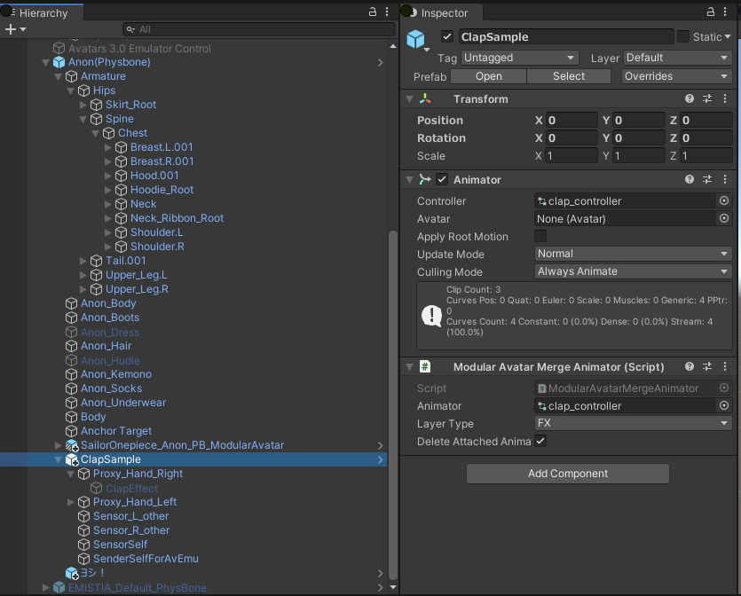
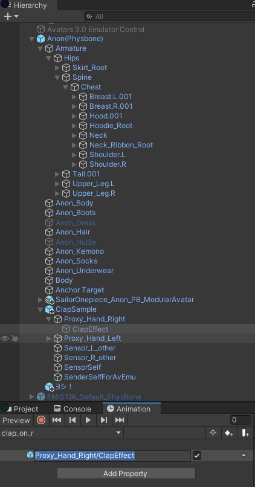
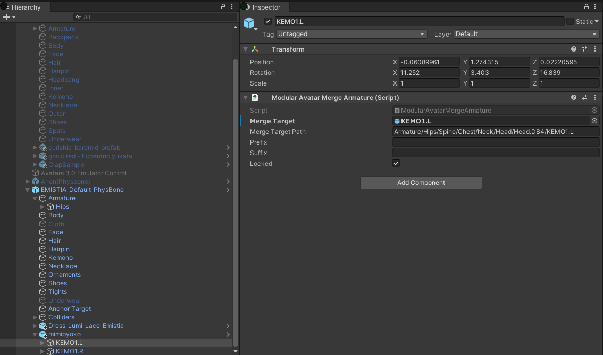

# Modular Avatar

Modular Avatar is a suite of **non-destructive** tools for modularizing your avatars, and for distributing avatar
components.
With Modular Avatar, adding a new outfit or gimmick to your avatar is as easy as drag-and-drop!

Modular Avatar currently supports:

* Merging prefab armatures into the parent avatar, as is often done to add outfits. MA minimizes the number of bones
  that are created in this process, reusing existing bones where possible.
* Merging subcomponent animators into the parent avatar, for use with various types of avatar gimmicks.

## Merging outfits (and similar things)

By attaching the Modular Avatar Merge Armature script to the armature of an outfit, Modular Avatar will merge this
outfit armature into the parent armature automatically at build or play time. The result looks a bit like this:

Note that new bones have only been created for bones that are present only in the outfit.

The Merge Armature script will automatically find corresponding bones under the Merge Target for each bone under the
transform it is attached to. It assumes each bone under the prefab to be merged to start with the Prefix and end with
the Suffix. If it finds an object that does not match, or if it can't find a corresponding base object, it will attach
this transform as a new child object in the base avatar (this can be used for bones corresponding to e.g. skirts or
ribbons).

The outfit can be enabled or disabled (including physbones and other dynamics) simply by toggling the prefab. To
facilitate this, any physbones or other components on the armature bones will remain at their old location, but will be
adjusted to reference the bones in the armature instead. For PhysBones and contacts, the root transform will be set to
point to the corresponding armature bone. For other components, a parent constraint will be automatically generated if
necessary.

Note also that as part of the armature merge, skinned meshes are adjusted (bindposes recalculated) in order to be
compatible with the base avatar's mesh. This means that outfits generated using different 3D software are still
compatible.

If fine adjustments to positioning are required, they can be made to the prefab armature before merging; as long as
the 'locked' option (described later) is disabled, the world position of the bones will be retained (effectively, it
will behave as if each bone was moved inside the corresponding bone in the base avatar).

## Merging more complex gimmicks

For gimmicks involving animators, Modular Avatar has a `Merge Animator` component.

This component will merge the specified animator controller into the corresponding Avatar 3.0 playable layer.
If `Delete Attached Avatar` is enabled, any animator on the same gameobject will also be deleted (having such an
animator around can be handy for editing animations).

In order to ease editing, animations on a merged animator should have their clips created based off of the location of
the Merge Animator script in the hierarchy. In other words, you don't cite the path up to the merge animator script, but
only the path from that point:

If you use the unity 'record animation' mode to record an animation on an animator on the same game object, this should
all Just Work.

### Placing objects elsewhere in the avatar

Your gimmick may sometimes need to put objects (eg contacts) at other places in the hierarchy. To do this, you could use
the Merge Armature script as described above, but this depends on matching up bone names and positions, and so is not
ideal for a gimmick that is meant to work with any avatar.

Instead, you can use the `Modular Avatar Proxy Bone` component. Attaching this component to a transform will cause that
transform to match its position and orientation to the humanoid bone (or sub-bone) in question.

Just drag the transform your want to reference onto Target, and the bone reference and sub path will be automatically
configured.

At build time, the proxy bone object will be moved under the actual bone in question, and animation references will be
updated to match.

### Animating humanoid bones

Normal humanoid animations can be used with merged animators without special setup.

### Animating non-humanoid bones

When animating non-humanoid bones (e.g. cat ears), some special setup is needed. Use a `Modular Avatar Merge Armature`
component with the `Locked` setting enabled:

When locked is enabled, the base bone and prefab bone will be locked together; if you move one, the other will move.
This means you can move your prefab's merge-armature proxy bones when recording an animation, and the corresponding
base-avatar bone will also update, making it easy to see what you're doing.

At build time, these proxy bones will be merged into the base avatar, so they won't count against performance stats.