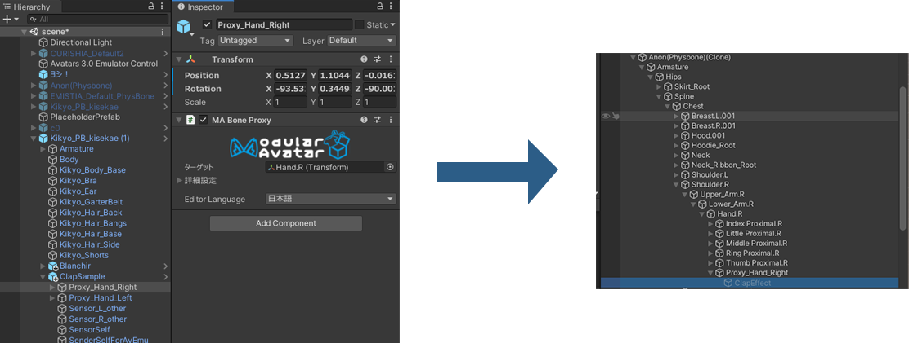

# Bone Proxy

The Bone Proxy allows you to place objects from your prefab inside of objects that are part of the original avatar.
For example, in the [Clap sample](../samples/#clap), this is used to place contacts inside the avatar's hands.

Bone Proxy will also adjust any animators referencing the old location of the objects so that they reference the
new paths after the objects are moved.

## When should I use it?

Bone Proxy should be used when you have objects that you want to place inside of existing objects inside the avatar.

## When shouldn't I use it?

Bone Proxy isn't intended to be used to configure clothing. Try using [Merge Armature](merge-armature.md) instead.

## Setting up Bone Proxy

Add the Bone Proxy component to an object in your prefab, and drag the destination of this object to the "Target" field.
The Bone Proxy-annotated object will then be placed inside the target object.

### Usage in prefabs

The Bone Proxy component automatically translates the object you specify into a humanoid bone and relative path reference.
This ensures that it can restore this reference automatically after it is saved in a prefab.

If you want to adjust the internal references, you can see them in the Advanced foldout.

### Attachment mode

Bone proxy can be attached in two different ways, depending on use case.

In the "As child at root" attachment mode, the object that the bone proxy is attached to will be reparented to the target object, and
its local position and orientation will be zeroed out. This will place it at the same position and orientation as the target object.
This mode is recommended for prefabs that are not avatar-specific.

In the "As child keep world position" attachment mode, the object that the bone proxy is attached to will be reparented to the target object,
but its world position and orientation will be preserved. This is usually only useful for avatar-specific prefabs, where you want to
place an object at a precise position relative to the parent bone. For example, it can be used to place colliders for cloth components.

When you set the target for a bone proxy component, the attachment mode will be automatically set based on whether the object is
currently at the target bone's position and orientation.