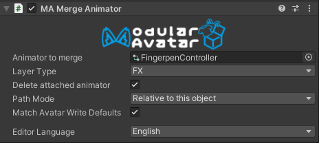
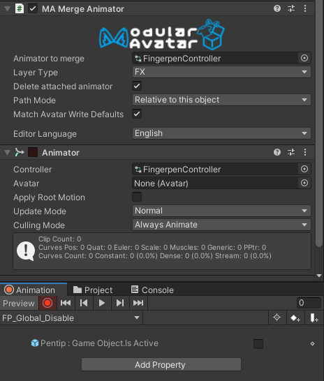

# Merge Animator

The merge animator component will add the provided animator to a specified layer of the avatar it is added to. This can be used to make complex AV3 gimmicks that install themselves just by dragging and dropping onto an avatar.

Two samples are included that use this component: A hand-clap effect, and a finger-pen gimmick.

## When should I use it?

Merge Animator should be used when you have animations you'd like to play back as part of your gimmick.

## When shouldn't I use it?

Merge Animator adds to, but does not replace existing animator layers. If you want the end-user to completely replace an animator layer, it may be better to have them replace it in the avatar descriptor in the traditional way.

## Setting up Merge Animator

Add the Merge Animator component to an object in your prefab, and attach the animator in the "Animator to merge" field. Set the "Layer Type" field to the avatar layer this should be added to (e.g. FX).

### Recording animations

By default, paths in your animator are interpreted as relative to the merge animator component. This makes it easy to record new animations, provided you're animating object underneath the Merge Animator component.

Just attach an Animator component to your GameObject, and you can use the Animation panel to record animations:

As a development convenience, you can check the "Delete attached animator" box to remove the animator component at build time.

### Humanoid bone animations

Animations that move humanoid bones ignore the relative path logic, and will always apply to the overall avatar. As such most humanoid animations (e.g. AFK animations) can be used as-is.

### Absolute path mode

If you want to animate objects that are already attached to the avatar (that aren't under your object), set the path mode to "Absolute". This will cause the animator to use absolute paths, and will not attempt to interpret paths relative to the Merge Animator component.
This means you will need to record your animations using the avatar's root animator instead.

### Write Defaults

By default, the write defaults state of your animator will not be changed. If you want to ensure that the WD settings of your animator states always matches the avatar's animator, click "Match Avatar Write Defaults".
This will detect whether the avatar is using write defaults ON or OFF states consistently, and if so your animator will be adjusted to match. If the avatar is inconsistent in its use of write defaults, your animator will be unchanged.
