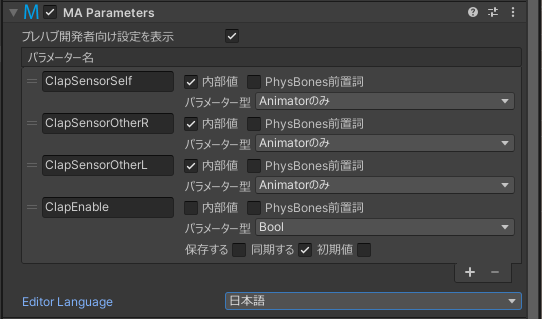

# Parameters

Parametersコンポーネントでは、アセットが内部で使っている、あるいはほかのアセットとの総合通信に使うアニメーターパラメーターを設定することができます。
ユーザーが名前かぶりを避けるためにパラメーター名を簡単に変更することができたり、アニメーターを触らずとも二つのアセットを連携できたりします。
また、同期パラメーターの自動設定もできます。

Parametersコンポーネントに表示モードが二つあります。一つはアセットユーザー向けで、もう一つはアセット作者向けです。
ユーザーがパラメーターの名前を変えたり、同期パラメーターの保存状態やデフォルト値を設定できます。
開発者モードでは、同期モードを設定したり、ユーザーが見えないように内部パラメーターとして設定できます。

 

## いつ使うもの？

VRChatの標準パラメーター以外のパラメーターを使ったアセットを作り時は使いましょう。

## 使い方

### ユーザー向け

Parametersコンポーネントで名前かぶりを避けるためにパラメーター名を変えたり、アバター読み込みでパラメーターの値が保存されるかを設定できます。
複数のアセットのパラメーターを同じにすることで、同じ値を共有させて、同時にアニメーションさせることができます。
また、被る名前を変えることで干渉を避けることもできます。

### プレハブ開発者向け

自分のアセットのルートにParametersを追加し、「プレハブ開発者向け設定を表示」をクリック。アセットで使われるパラメーターのリストが表示されます。

パラメーターには以下の設定があります。
* 内部値 - パラメーターを非表示にし、ユニークな名前に自動変更します
* PhysBones前置詞 - この値がPhysBoneのparameter欄に設定されるもので、いくつかのサブパラメーターのくくりであることを示します。
* 同期モード - 同期されるかどうかと、同期される値の種別を指定します

Parametersコンポーネントは、入れ子式（ネスト状）で使うことができます。複雑なアセットをサブプレハブから構築し、名前かぶりを避けつつ同じプレハブを複数回使ったりすることもできます。

パラメーターの名前変更は、Parametersコンポーネントと同じオブジェクトとその子に付いている、以下のコンポーネントに適用されます
* [Modular Avatar Merge Animator](merge-animator.md)
* [Modular Avatar Menu Installer](menu-installer.md)
* VRC Physics Bone
* VRC Contact Receiver
* Animator (あまり役に立たないかもしれませんが・・・)
