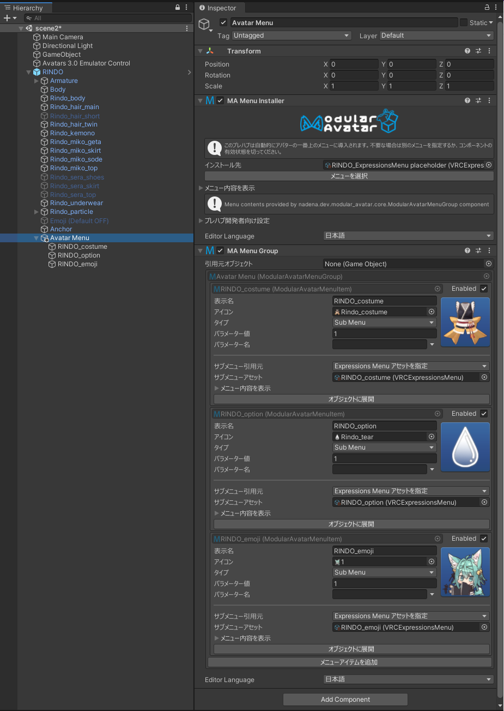
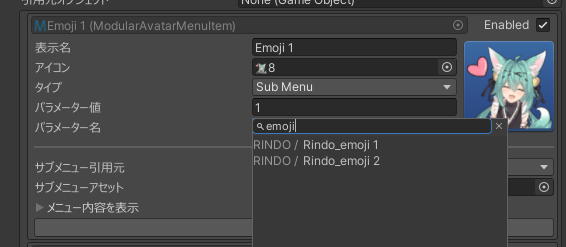
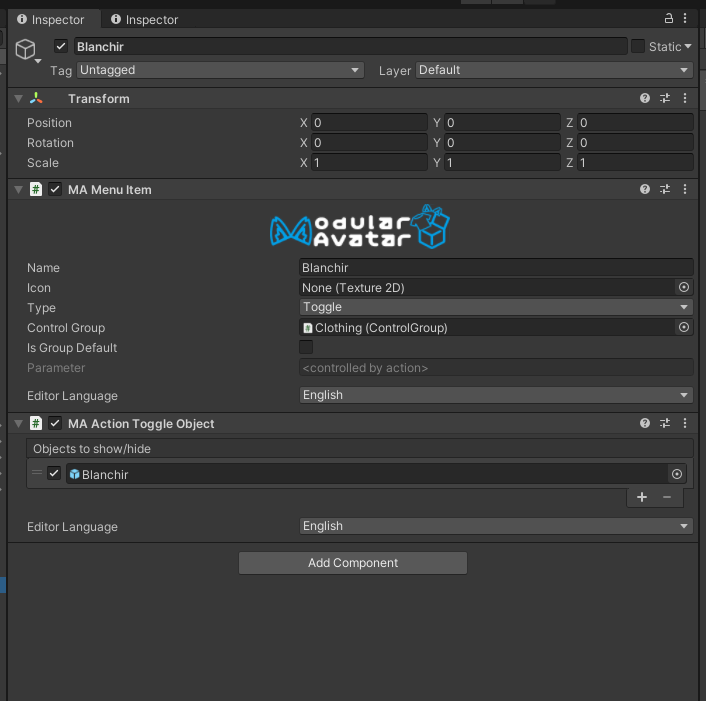
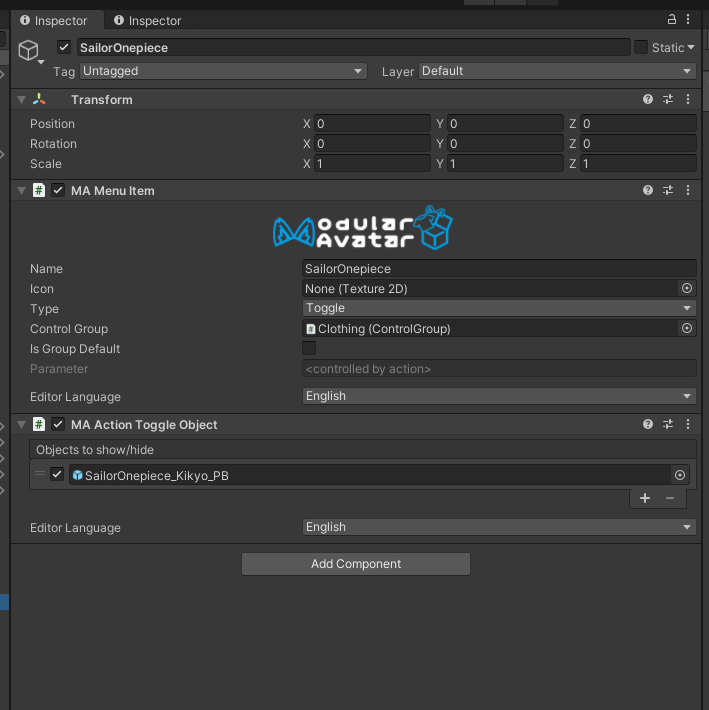

# メニューを編集

Modular Avatarには、オブジェクトベースのメニュー編集機能があります。これを使うと、Unityのインスペクターから簡単にメニューを編集したり、インスペクターだけでシンプルなトグルを作成したりできます。

このチュートリアルでは、既存のアバターのメニューを編集する方法と、アセットに含める方法を紹介します。

## 既存アバターのメニューを変換します

一番簡単に始める方法は、既存のアバターのメニューを変換することです。アバターを右クリックして、`[Modular Avatar] Extract menu`を選択します。

When you do this, a new `Avatar Menu` object will be added to your avatar, containing the top level of your avatar's menu.

すると、新しい`Avatar Menu`オブジェクトがアバターに追加されます。これには、アバターのメニュートップの項目が入っています。

御覧の通り、メニューアイテムがオブジェクト化しています。各メニューアイテムを個別に見ることもできます。

「オブジェクトに展開」ボタンを押すと、このサブメニューも変換できます。これでメニューの各階層をヒエラルキーで見れます。

オブジェクト化したら、アイテムをドラッグアンドドロップでメニュー内で移動させられます。

### 新規メニュー項目を追加

メニューを展開したら、「メニューアイテムを追加」ボタンを押すことで新しい項目を追加できます。

リストの最後に新規アイテムが追加されます。そのあと名前、タイプ、パラメーターなどを設定できます。

サブメニューを作るなら、「タイプ」を「Sub Menu」にして、「サブメニューの引用元」を「子オブジェクトから生成」にしましょう。そしたら、サブメニューオブジェクトから「メニューアイテムを追加」を押すことで追加できます。

### パラメーター設定

パラメーターを設定するときは、パラメーター名欄の右にある矢印を押すことで、名前で検索できます。親にあるMA Parametersコンポーネントも考慮されます。

## トグルを作成

Modular Avatarにはヒエラルキーから簡単なトグルアニメーションを作る機能もあります。まずは簡単なON/OFFトグルを見てみましょう。

このオブジェクトは「Simple Toggle」というサンプルとして同封されます。見ての通り、MA Menu ItemにMA Action Toggle Objectを追加し、メニューアイテムをToggleタイプにし、表示・非表示にするオブジェクトを設定しただけです。

Cubeの隣のチェックは、トグルがＯＮになったときは表示するべきで、ＯＦＦになったときは非表示にするべきという意味です。チェックを外すと、逆にメニューがＯＦＦのときに表示し、ＯＮのときは非表示になります。

:::tip

オブジェクトリストにドラッグアンドドロップでオブジェクトを簡単に追加できます。

:::

### 複数選択トグル

もうすこし複雑なトグルを作りたいときもあるでしょう。複数のトグルを一つのグループにするためには「MA Control Group」も作ります。例を見てみましょう。

こちらはControl Groupがついている衣装切り替えメニューです。Control group自体には設定項目がなく、メニューアイテムを一括りにするためだけにあります。各メニューアイテムも見てみましょう。

見ての通り、どれも「Toggle」タイプで、「MA Action Toggle Object」コンポーネントがついています。違うのは、Control Groupのオブジェクトを「コントロールグループ」に指定し、デフォルトの衣装に「グループの初期設定にする」をチェックしています。

コントロールグループを指定すると、その中から一つのメニューアイテムしか設定できないようになります。同じパラメーターで連動するというわけです。

コントロールグループに連動するアイテムのうちから一つを初期設定にできます。すると、そのトグルが最初から設定される状態になり、そのトグルで表示されるものが他のトグルでは非表示になります（その逆もしかり）。この例の場合、「Kikyo_Blouse」、「Kikyo_Coat」、「Kikyo_Skirt」を初期項目でＯＮにしたので、BlanchirとSailorOnepieceでは無効かされます。この挙動が不要の場合は、ほかの項目に該当オブジェクトを追加し、手動で設定できます。

### 制限

この機能は開発途中のもので、いくつか制限があります。

1. 一つのオブジェクトは一つのコントロールグループまたはグループに入っていないトグルにしか操作できない。
2. 現在、トグルの状態が保存されません。アバター変更・ワールド移動で状態が保持されないということです。
3. 一つのトグルでアクションと通常のアニメーターを両方操作できません。

今後のリリースで改善していく予定です。

## 再利用できるアセットでの応用

新しいメニューアイテムシステムを配布アセットなどでも利用できます。サンプルとしては、FingerpenやSimpleToggleアセットにご参照ください。

簡単に解説すると、一つの項目またはサブメニューを追加するなら、MA Menu InstallerとMA Menu Itemを両方同じオブジェクトに追加してください。Menu Itemがアバターに自動的に追加されます。
サブメニューにグループしないで複数の項目を追加する場合は、MA Menu InstallerとMA Menu Groupを両方追加しましょう。Menu Groupはサブメニューに入れずに複数の項目を追加できるようにするコンポーネントです。Extract menuと同じ仕様です。